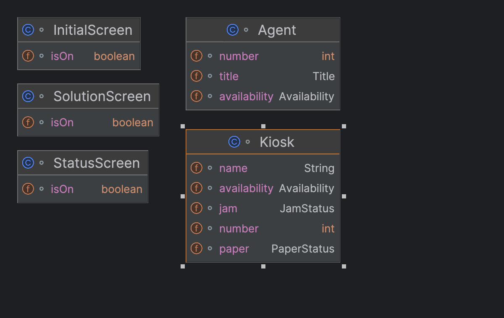

# Rapport sur le système de gestion des kiosques avec Jrules

## Introduction
Ce système comprend des objets de deux catégories, les objets statiques et les objets dynamiques. Les objets statiques
les objets non statiques sont les objets qui sont créés par les utilisateurs du système.

###  Les objets statiques
Les objets sont des écrans servant à afficher des informations aux utilisateurs. Ils sont créés en ordre:
1. classe InitialScreen
2. classe StatusScreen
3. classe SolutionScreen
Chacun de ces objets ne comprend qu'un seul attribut: isOn, qui indique si l'écran est allumé ou éteint.
L'allumage et l'extinction des écrans sont gérés par les règles.

### Les objets dynamiques
Les objets dynamiques sont créés par les utilisateurs du système. 
Ils sont peuvent être modifiés au cours du fonctionnement du système.
1. classe Kiosk

| Kiosk                                              |
|----------------------------------------------------|
| name : String                                      |
| number : int                                       |
| JamStatus: {JAMMED, NOT_JAMMED}                    |
| PaperStatus: {OUT_OF_PAPER, LOW_PAPER, HIGH_PAPER} |
| Availability: {AVAILABLE, NOT_AVAILABLE}           |


2. classe Agent

| Agent                                              |
|----------------------------------------------------|
| title : {TECHNICIAN, REPRESENTATIVE}               |
| number : int                                       |
| Availability: {AVAILABLE, NOT_AVAILABLE}           |


Voici le UML du système:


## Les règles
Les règles sont définies dans le but d'être déclenchées duran trois phases différentes
pour chacun des écrans, leurs moments d'exécution sont gérés par priorité et
par la lexicographie des noms des règles.

### Phase du InitialScreen

Voici les règles dès l'initialisation du système, elles sont déclenchées par leur priorité et déduisent
la valeur de l'attribut "Availability" de chaque kiosque en arrière-plan.

```jrules
/*
    * Cette règle se lit:
    * Si un kiosque n'est pas bourré et n'est pas à court de papier, alors il est disponible.
*/
rule isAvailable {
    priority = high;
    when {
        ?k: Kiosk(jam=="not jammed"; ~paper=="out of paper"); //the ~ means not
    }
    then {
        modify ?k {
            availability = "available";
        };
    }
};

/*
    * Cette règle se lit:
    * Si un kiosque est bourré, alors il n'est pas disponible.
*/

rule isNotAvailableBecauseJam {
    priority = high;
    when {
        ?k: Kiosk(jam=="jammed");
    }
    then {
        modify ?k {
            availability = "not available";
        };
    }
};

/*
    * Cette règle se lit:
    * Si un kiosque est à court de papier, alors il n'est pas disponible.
*/
rule isNotAvailableBecausePaper {
    priority = high;
    when {
        ?k: Kiosk(paper=="out of paper");
    }
    then {
        modify ?k {
            availability = "not available";
        };
    }
};
```

Ensuite, il y a les règles qui présentent des messages à l'utilisateur, 
elles sont déclenchées par leur lexicographie.
À cette phase, nous présentons les scénarios initiaux.
Cependant, les valeurs de "Availability" des kiosques sont déjà déduites
par les règles précédentes.

```jrules
/*
    * Cette règle se lit:
    * Si l'écran initial est allumé, alors afficher le titre de l'écran initial.
*/
rule 1displayInitialScreenTitle {
    when {
        ?s: InitialScreen(isOn == true);
    }
    then {
        System.out.println("\nInitial Screen");
        System.out.println("-----------------");

    }
};

/*
    * Cette règle se lit:
    * Si l'écran initial est allumé, alors afficher les informations de chaque kiosque.
*/
rule 2displayInitialScreenKiosks {
    when {
        ?s: InitialScreen(isOn == true);
        ?k: Kiosk(); //this will match any kiosk
    }
    then {
        System.out.println("Kiosk " + ?k.number + " : " + ?k.name + ", " + ?k.paper + ", " + ?k.jam);

    }
};

/*
    * Cette règle se lit:
    * Si l'écran initial est allumé, alors afficher les informations de chaque agent. Un
    * fois terminé, éteindre l'écran initial et allumer l'écran de statut.
*/
rule 3displayInitialScreenAgents {
    when {
        ?s: InitialScreen(isOn == true);
        ?a: Agent(); //this will match any agent

    }
    then {
        System.out.println("Agent " + ?a.number + " : " + ?a.title);
        modify ?s {
            isOn = false;
        };
        assert StatusScreen(true); //this will display the status screen
    }
};
```

### Phase du StatusScreen
Dans cette phase, nous présentons les scénarios, les états des kiosques et des agents.
Les règles sont déclenchées par leur lexicographie.
Les disponibilités des kiosques ont été déduites précédemment.

```jrules
/*
    * Cette règle se lit:
    * Si l'écran de statut est allumé, alors afficher le titre de l'écran de statut.
*/
rule 1displayStatusScreenTitle {
    when {
        ?s: StatusScreen(isOn == true);
    }
    then {
        System.out.println("\nStatus Screen");
        System.out.println("-----------------");

    }
};

/*
    * Cette règle se lit:
    * Si l'écran de statut est allumé, alors afficher les informations de chaque kiosque.
*/
rule 2displayStatusScreenKiosks {
    when {
        ?s: StatusScreen(isOn == true);
        ?k: Kiosk(); //this will match any kiosk
    }
    then {
        System.out.println("Kiosk " + ?k.number + " " + ?k.name + " is " + ?k.availability + " 
        because " + ?k.paper + " and " + ?k.jam));
    }
};

/*
    * Cette règle se lit:
    * Si l'écran de statut est allumé, alors afficher les informations de chaque agent. Un
    * fois terminé, éteindre l'écran de statut et allumer l'écran de solution.
*/
rule 3displayStatusScreenAgents {
    when {
        ?s: StatusScreen(isOn == true);
    }
    then {
        System.out.println("1 Technician and 1 Representatives are available");
        modify ?s {
            isOn = false;
        };
        assert SolutionScreen(true); //this will display the solution screen
    }
};
```

### Phase du SolutionScreen
Dans cette phase, nous allons résoudre le problème de chaque kiosque.
Tout d'abord, nous allons allumer l'écran de solution:
Cette règle de priorité haute est déclenchée dès que l'écran de solution est allumé.
```jrules
/*
    * Cette règle se lit:
    * Si l'écran de solution est allumé, alors afficher le titre de l'écran de solution.
*/
rule displaySolutionScreenTitle {
    priority = high;
    when {
        ?s: SolutionScreen(isOn == true);
    }
    then {
        System.out.println("\nSolution Screen");
        System.out.println("-----------------");

    }
};
```

Ensuite, nous allons résoudre le problème de chaque kiosque.
Le premier jeu de règles présente les statuts seulement, ces règles se déclenchent
à chaque changement dans le working mémory du système par réfraction et par priorité.
```jrules
/*
    * Cette règle se lit:
    * Si un kiosque est bourré et que l'écran de solution est allumé, 
    * alors afficher que le kiosque n'est pas disponible à cause du bourrage.
*/
rule isJammed {
    priority = medium;
    when {
        ?k: Kiosk(jam==JAMMED);
        ?s: SolutionScreen(isOn == true);//this rule will not be triggered when SolutionScreen is off
    }
    then {
        System.out.println(?k.name + " is not available because paper jam");
    }
};

/*
    * Cette règle se lit:
    * Si un kiosque est à court de papier et que l'écran de solution est allumé, 
    * alors afficher que le kiosque n'est pas disponible à cause du manque de papier.
*/
rule isPaperOut {
    priority = medium;
    when {
        ?k: Kiosk(paper==OUT_OF_PAPER);
        ?s: SolutionScreen(isOn == true); //this rule will not be triggered when SolutionScreen is off
    }
    then {
        System.out.println(?k.name + " is not available because out of paper");
    }
};

/*
    * Cette règle se lit:
    * Si un kiosque est plein de papier et que l'écran de solution est allumé, 
    * alors afficher que le kiosque est disponible.
*/
rule isPaperHigh{
    priority = medium;
    when {
        ?k: Kiosk(paper=="HIGH_PAPER"; jam=="NOT_JAMMED");
        ?s: SolutionScreen(isOn == true); //this rule will not be triggered when SolutionScreen is off
    }
    then {
        System.out.println(?k.name + " is available");
    }
};

/*
    * Cette règle se lit:
    * Si un kiosque a peu de papier et que l'écran de solution est allumé, 
    * alors afficher que le kiosque est disponible mais manquera de papier.
*/
rule isPaperLow{
    priority = medium;
    when {
        ?k: Kiosk(paper=="LOW_PAPER"; jam=="NOT_JAMMED");
        ?s: SolutionScreen(isOn == true); //this rule will not be triggered when SolutionScreen is off
    }
    then {
        System.out.println(?k.name + " is available" because no jam and low paper);
    }
};
```

Le deuxième jeu de règles modifie les statuts des kiosques, ces règles se déclenchent
par lexicographie, elles causent des changements dans le working memory du système.
L'ordre lexicographique dicte l'ordre d'importance des règles:
D'abord enlever le bourrage, ensuite remplir de papier pour les kiosques à court de papier,
et finalement remplir de papier pour les kiosques à peu de papier.
La conclusion de chaque règle modifie aussi la disponibilité des agents pour
illustrer qu'ils sont occupés et seulement deux agents sont disponibles pour tous
les kiosques.
```jrules
/*
    * Cette règle se lit:
    * Si un kiosque est bourré et que l'écran de solution est allumé, 
    * Et qu'un technicien est disponible,
    * alors un technicien est appelé pour résoudre le problème.
    * Le kiosque se voit enlever le bourrage.
    * Une fois le problème résolu, le technicien redevient disponible.
*/
rule 1callTechToRemoveJam {
    when {
        ?k: Kiosk(jam=="JAMMED");
        ?s: SolutionScreen(isOn == true);
        ?a: Agent(title=="TECHNICIAN"; availability=="AVAILABLE");
    }
    then {
        modify ?a {
            availability = "NOT_AVAILABLE";
        };
        System.out.println("a tech removes jam from " + ?k.name);
        modify ?k {
            jam = "NOT_JAMMED";
        };
        modify ?a {
            availability = "AVAILABLE";
        };
    }
};

/*
    * Cette règle se lit:
    * Si un kiosque est à court de papier et que l'écran de solution est allumé, 
    * Et qu'un représentant est disponible,
    * alors un représentant est appelé pour résoudre le problème.
    * Le kiosque se voit remplir de papier.
    * Une fois le problème résolu, le représentant redevient disponible.
*/
rule 2callRepToRefillPaper {
    when {
        ?k: Kiosk(paper=="OUT_OF_PAPER"; jam=="NOT_JAMMED");
        ?s: SolutionScreen(isOn == true);
        ?a: Agent(title=="REPRESENTATIVE"; availability=="AVAILABLE");
    }
    then {
        modify ?a {
            availability = "NOT AVAILABLE";
        };
        System.out.println("a rep adds a new roll to " + ?k.name);
        modify ?k {
            paper = "HIGH_PAPER";
        };
        modify ?a {
            availability = "AVAILABLE";
        };
    }
};

/*
    * Cette règle se lit:
    * Si un kiosque a peu de papier et que l'écran de solution est allumé, 
    * Et qu'un représentant est disponible,
    * alors un représentant est appelé pour résoudre le problème.
    * Le kiosque se voit remplir de papier.
    * Une fois le problème résolu, le représentant redevient disponible.
*/
rule 3callRepToRefillPaper {
    when {
        ?k: Kiosk(paper=="LOW_PAPER"; jam=="NOT_JAMMED");
        ?s: SolutionScreen(isOn == true); 
        ?a: Agent(title=="REPRESENTATIVE"; availability=="AVAILABLE");
    }
    then {
        modify ?a {
            availability = "NOT AVAILABLE";
        };
        System.out.println("a rep adds a new roll to " + ?k.name);
        modify ?k {
            paper = "HIGH_PAPER";
        };
        modify ?a {
            availability = "AVAILABLE";
        };
    }
};
```

## Conclusion avec deux simulations de l'exécution du système
Voici la sortie de la simulation de l'exécution du système avec ce setup:
```jrules
setup {
    assert InitialScreen(true);
    assert Kiosk("CarRental", 1, "NOT_JAMMED", "LOW_PAPER");
    assert Kiosk("Park", 2, "NOT_JAMMED", "HIGH_PAPER");
    assert Agent("TECHNICIAN", 1, "AVAILABLE");
    assert Agent("REPRESENTATIVE", 2, "AVAILABLE");
}
```

```jrules
Initial Screen
-----------------
Kiosk 1 : CarRental, LOW_PAPER, JAMMED
Kiosk 2 : Park, LOW_PAPER, NOT_JAMMED
Agent 1 : TECHNICIAN
Agent 2 : REPRESENTATIVE

Status Screen
-----------------
Kiosk 1 CarRental is NOT AVAILABLE because LOW_PAPER and JAMMED
Kiosk 2 Park is AVAILABLE because HIGH_PAPER and NOT_JAMMED
1 Technician and 1 Representatives are available

Solution Screen
-----------------
CarRental is not available because paper jam //triggered by isJammed rule
Park is available because of no jam and low paper //triggered by isPaperLow rule
A tech removes jam from CarRental //triggered by 1callTechToRemoveJam rule
CarRental is available because of no jam and low paper//triggered by isPaperLow rule
A rep adds a new roll to CarRental //triggered by 3callRepToRefillPaper rule
CarRental is available //triggered by isPaperHigh rule
A rep adds a new roll to Park //triggered by 3callRepToRefillPaper rule
Park is available //triggered by isPaperHigh rule
```

Voici la sortie de la simulation de l'exécution du système avec ce setup:
```jrules
setup {
    assert InitialScreen(true);
    assert Kiosk("CarRental", 1, "JAMMED", "LOW_PAPER");
    assert Kiosk("Park", 2, "NOT_JAMMED", "OUT_OF_PAPER");
    assert Agent("TECHNICIAN", 1, "AVAILABLE");
    assert Agent("REPRESENTATIVE", 2, "AVAILABLE");
}
```

```jrules
Initial Screen
-----------------
Kiosk 1 : CarRental, LOW_PAPER, JAMMED
Kiosk 2 : Park, OUT_OF_PAPER, NOT_JAMMED
Agent 1 : TECHNICIAN
Agent 2 : REPRESENTATIVE

Status Screen
-----------------
Kiosk 1 CarRental is NOT AVAILABLE because JAMMED
Kiosk 2 Park is NOT AVAILABLE because OUT_OF_PAPER
1 Technician and 1 Representatives are available

Solution Screen
-----------------
CarRental is not available because paper jam
Park is not available because out of paper
A tech removes jam from CarRental
CarRental is available because of no jam and low paper
A rep adds a new roll to CarRental
CarRental is available
Park is not available because out of paper
A rep adds a new roll to Park
Park is available 
```


